[TOC]

## 大数据平台架构演进

### 经典数仓架构

在类似于Hadoop系列的大数据分析系统大行其道之前，数据分析工作已经经历了长足的发展，尤其是以BI系统为主的数据分析，已经有了非常成熟和稳定的技术方案和生态系统，对于BI系统来说，大概的架构图如下：

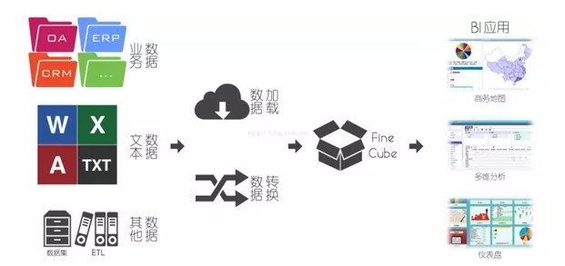

<!-- more -->

可以看到在BI系统里面，核心的模块是Cube，Cube是一个更高层的业务模型抽象，在Cube之上可以进行多种操作，例如上钻、下钻、切片等操作。大部分BI系统都基于关系型数据库，关系型数据库使用SQL语句进行操作，但是SQL在多维操作和分析的表示能力上相对较弱，所以Cube有自己独有的查询语言MDX，MDX表达式具有更强的多维表现能力，所以以Cube为核心的分析系统基本占据着数据统计分析的半壁江山，大多数的数据库服务厂商直接提供了BI套装软件服务，轻易便可搭建出一套Olap分析系统。不过BI的问题也随着时间的推移逐渐显露出来：

- BI系统更多的以分析业务数据产生的密度高、价值高的结构化数据为主，对于非结构化和半结构化数据的处理非常乏力，例如图片，文本，音频的存储，分析。

- 由于数据仓库为结构化存储，在数据从其他系统进入数据仓库这个东西，我们通常叫做ETL过程，ETL动作和业务进行了强绑定，通常需要一个专门的ETL团队去和业务做衔接，决定如何进行数据的清洗和转换。

- 随着异构数据源的增加，例如如果存在视频，文本，图片等数据源，要解析数据内容进入数据仓库，则需要非常复杂等ETL程序，从而导致ETL变得过于庞大和臃肿。

- 当数据量过大的时候，性能会成为瓶颈，在TB/PB级别的数据量上表现出明显的吃力。

- 数据库的范式等约束规则，着力于解决数据冗余的问题，是为了保障数据的一致性，但是对于数据仓库来说，我们并不需要对数据做修改和一致性的保障，原则上来说数据仓库的原始数据都是只读的，所以这些约束反而会成为影响性能的因素。

- ETL动作对数据的预先假设和处理，导致机器学习部分获取到的数据为假设后的数据，因此效果不理想。例如如果需要使用数据仓库进行异常数据的挖掘，则在数据入库经过ETL的时候就需要明确定义需要提取的特征数据，否则无法结构化入库，然而大多数情况是需要基于异构数据才能提取出特征。

在一系列的问题下，以Hadoop体系为首的大数据分析平台逐渐表现出优异性，围绕Hadoop体系的生态圈也不断的变大，对于Hadoop系统来说，从根本上解决了传统数据仓库的瓶颈的问题，但是也带来一系列的问题：

- 从数据仓库升级到大数据架构，是不具备平滑演进的，基本等于推翻重做。

- 大数据下的分布式存储强调数据的只读性质，所以类似于Hive，HDFS这些存储方式都不支持update，HDFS的write操作也不支持并行，这些特性导致其具有一定的局限性。

基于大数据架构的数据分析平台侧重于从以下几个维度去解决传统数据仓库做数据分析面临的瓶颈：

- 分布式计算：分布式计算的思路是让多个节点并行计算，并且强调数据本地性，尽可能的减少数据的传输，例如Spark通过RDD的形式来表现数据的计算逻辑，可以在RDD上做一系列的优化，来减少数据的传输。

- 分布式存储：所谓的分布式存储，指的是将一个大文件拆成N份，每一份独立的放到一台机器上，这里就涉及到文件的副本，分片，以及管理等操作，分布式存储主要优化的动作都在这一块。

- 检索和存储的结合：在早期的大数据组件中，存储和计算相对比较单一，但是目前更多的方向是在存储上做更多的手脚，让查询和计算更加高效，对于计算来说高效不外乎就是查找数据快，读取数据快，所以目前的存储不单单的存储数据内容，同时会添加很多元信息，例如索引信息。像类似于parquet和carbondata都是这样的思想。

总的来说，目前围绕Hadoop体系的大数据架构大概有以下几种：

### 传统大数据架构

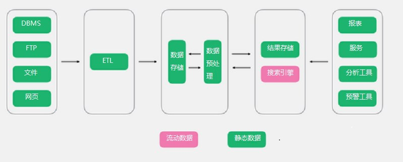

之所以叫传统大数据架构，是因为其定位是为了解决传统BI的问题，简单来说，数据分析的业务没有发生任何变化，但是因为数据量、性能等问题导致系统无法正常使用，需要进行升级改造，那么此类架构便是为了解决这个问题。可以看到，其依然保留了ETL的动作，将数据经过ETL动作进入数据存储。

- 优点：简单，易懂，对于BI系统来说，基本思想没有发生变化，变化的仅仅是技术选型，用大数据架构替换掉BI的组件。

- 缺点：对于大数据来说，没有BI下如此完备的Cube架构，虽然目前有kylin，但是kylin的局限性非常明显，远远没有BI下的Cube的灵活度和稳定度，因此对业务支撑的灵活度不够，所以对于存在大量报表，或者复杂的钻取的场景，需要太多的手工定制化，同时该架构依旧以批处理为主，缺乏实时的支撑。

- 适用场景：数据分析需求依旧以BI场景为主，但是因为数据量、性能等问题无法满足日常使用。

### 流式架构

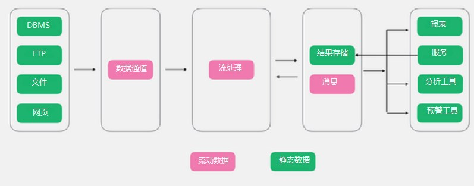

在传统大数据架构的基础上，流式架构非常激进，直接拔掉了批处理，数据全程以流的形式处理，所以在数据接入端没有了ETL，转而替换为数据通道。经过流处理加工后的数据，以消息的形式直接推送给了消费者。虽然有一个存储部分，但是该存储更多的以窗口的形式进行存储，所以该存储并非发生在数据湖，而是在外围系统。

- 优点：没有臃肿的ETL过程，数据的实效性非常高。

- 缺点：对于流式架构来说，不存在批处理，因此对于数据的重播和历史统计无法很好的支撑。对于离线分析仅仅支撑窗口之内的分析。

- 适用场景：预警，监控，对数据有有效期要求的情况。

### Lambda架构

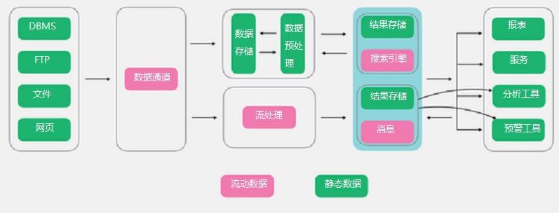

Lambda架构算是大数据系统里面举足轻重的架构，大多数架构基本都是Lambda架构或者基于其变种的架构。Lambda的数据通道分为两条分支：实时流和离线。

实时流依照流式架构，保障了其实时性，而离线则以批处理方式为主，保障了最终一致性。什么意思呢？流式通道处理为保障实效性更多的以增量计算为主辅助参考，而批处理层则对数据进行全量运算，保障其最终的一致性，因此Lambda最外层有一个实时层和离线层合并的动作，此动作是Lambda里非常重要的一个动作，大概的合并思路如下：

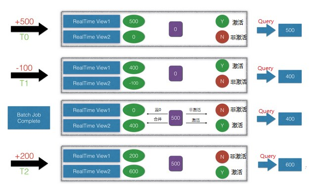

- 优点：既有实时又有离线，对于数据分析场景涵盖的非常到位。

- 缺点：离线层和实时流虽然面临的场景不相同，但是其内部处理的逻辑却是相同，因此有大量荣誉和重复的模块存在。

- 适用场景：同时存在实时和离线需求的情况。

### Kappa架构

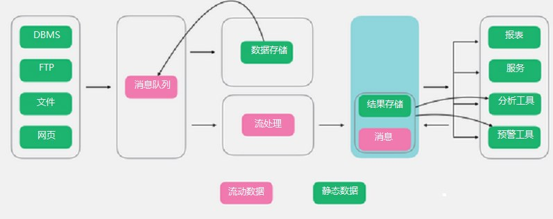

Kappa架构在Lambda 的基础上进行了优化，将实时和流部分进行了合并，将数据通道以消息队列进行替代。因此对于Kappa架构来说，依旧以流处理为主，但是数据却在数据湖层面进行了存储，当需要进行离线分析或者再次计算的时候，则将数据湖的数据再次经过消息队列重播一次则可。

- 优点：Kappa架构解决了Lambda架构里面的冗余部分，以数据可重播的超凡脱俗的思想进行了设计，整个架构非常简洁。

- 缺点：虽然Kappa架构看起来简洁，但是施难度相对较高，尤其是对于数据重播部分。

- 适用场景：和Lambda类似，改架构是针对Lambda的优化。

### Unifield架构

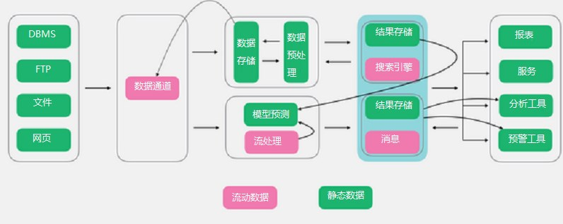

以上的种种架构都围绕海量数据处理为主，Unifield架构则更激进，将机器学习和数据处理揉为一体，从核心上来说，Unifield依旧以Lambda为主，不过对其进行了改造，在流处理层新增了机器学习层。可以看到数据在经过数据通道进入数据湖后，新增了模型训练部分，并且将其在流式层进行使用。同时流式层不单使用模型，也包含着对模型的持续训练。

- 优点：Unifield架构提供了一套数据分析和机器学习结合的架构方案，非常好的解决了机器学习如何与数据平台进行结合的问题。

- 缺点：Unifield架构实施复杂度更高，对于机器学习架构来说，从软件包到硬件部署都和数据分析平台有着非常大的差别，因此在实施过程中的难度系数更高。

- 适用场景：有着大量数据需要分析，同时对机器学习方便又有着非常大的需求或者有规划。

### IOTA架构

在IOT大潮下，智能手机、PC、智能硬件设备的计算能力越来越强，而业务需求要求数据实时响应需求能力也越来越强，过去传统的中心化、非实时化数据处理的思路已经不适应现在的大数据分析需求，我提出新一代的大数据IOTA架构来解决上述问题，整体思路是设定标准数据模型，通过边缘计算技术把所有的计算过程分散在数据产生、计算和查询过程当中，以统一的数据模型贯穿始终，从而提高整体的预算效率，同时满足即时计算的需要，可以使用各种Ad-hoc Query来查询底层数据。

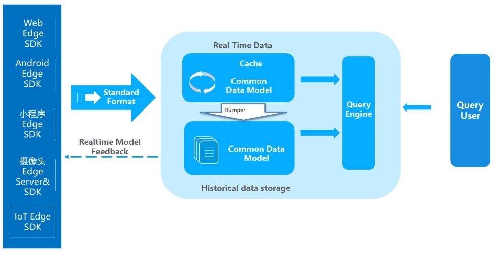

优点：

- 去ETL化：ETL和相关开发一直是大数据处理的痛点。TA架构通过Common Data Model的设计，专注在某一个具体领域的数据计算，从而可以从SDK端开始计算，中央端只做采集、建立索引和查询，提高整体数据分析的效率

- Ad-hoc即时查询：鉴于整体的计算流程机制，在手机端、智能IOT事件发生之时，就可以直接传送到云端进入real time data区，可以被前端的Query Engine来查询。此时用户可以使用各种各样的查询，直接查到前几秒发生的事件，而不用在等待ETL或者Streaming的数据研发和处理。

- 边缘计算（Edge-Computing）：将过去统一到中央进行整体计算，分散到数据产生、存储和查询端，数据产生既符合Common Data Model。同时，也给与Realtime model feedback，让客户端传送数据的同时马上进行反馈，而不需要所有事件都要到中央端处理之后再进行下发。

## 互联网公司大数据平台架构

### 阿里巴巴

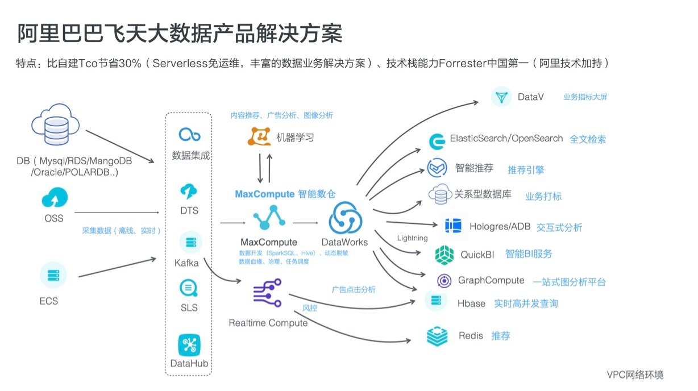

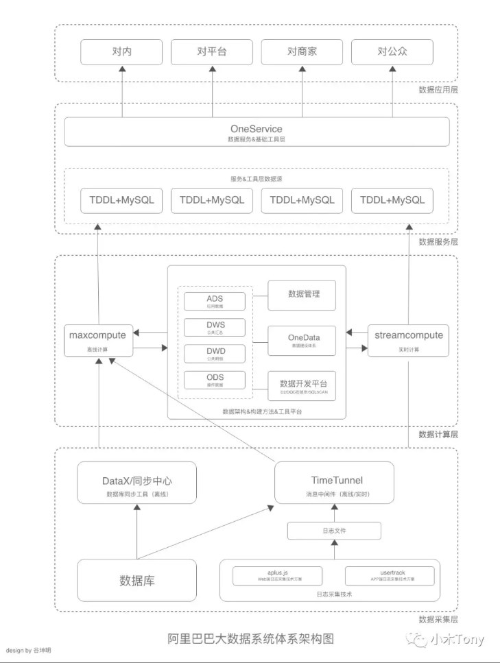

[阿里巴巴飞天大数据架构体系与Hadoop生态系统](https://zhuanlan.zhihu.com/p/82258807)
[大数据架构体系与Hadoop生态系统](https://mp.weixin.qq.com/s/PUM-uA55E24LSHq4InQwSg)

### 酷狗音乐的大数据平台架构

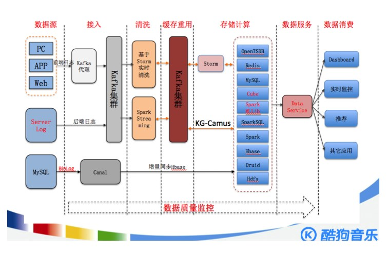

[经典大数据架构案例：酷狗音乐的大数据平台重构](https://www.infoq.cn/article/kugou-big-data-platform-restructure)

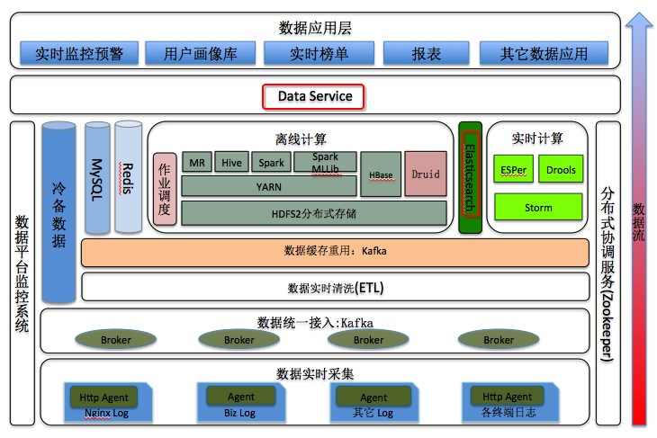

### 滴滴大数据平台架构

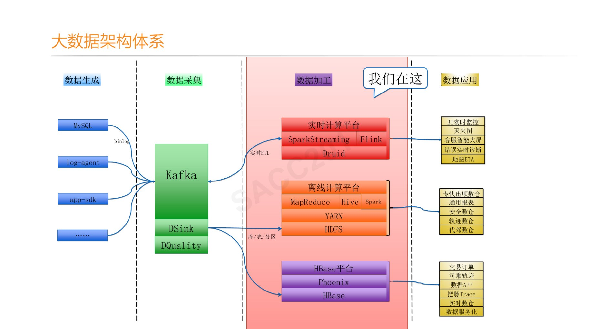

[罗李：滴滴大数据离线和实时平台架构和实践](https://myslide.cn/slides/15307#)

### 知乎大数据平台架构

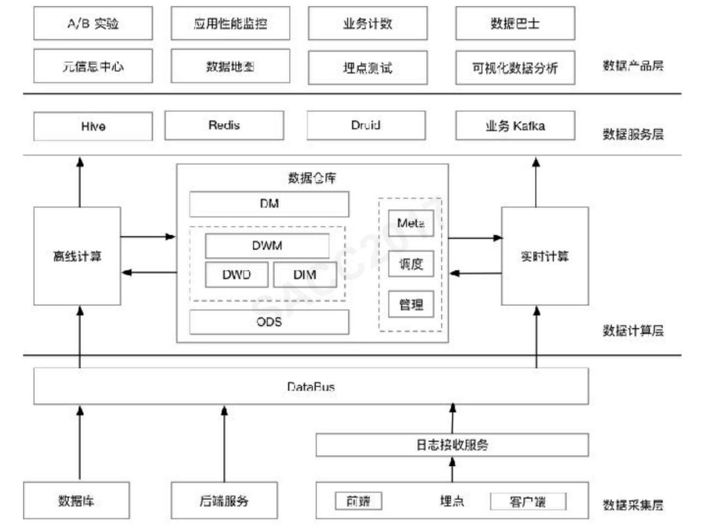

[知乎大数据平台架构和实践优化](https://myslide.cn/slides/15294#)

### 美团大数据平台架构

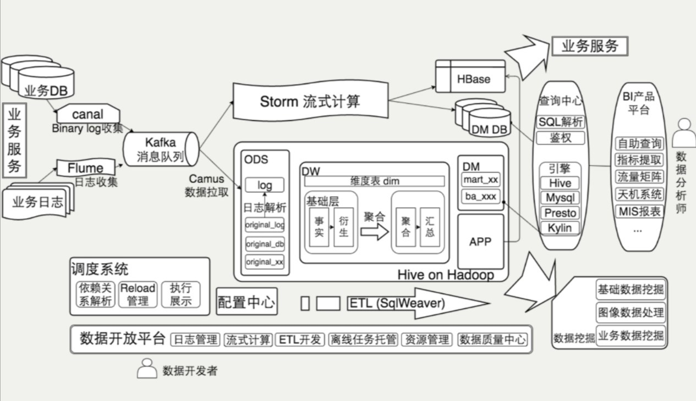

[美团的大数据平台架构实践](https://zhuanlan.zhihu.com/p/26359613)

### 爱奇艺

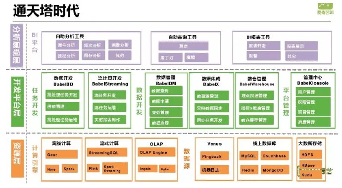

[爱奇艺大数据分析平台的演进之路](https://mp.weixin.qq.com/s/weHYPEZEzxsaJlP-zd7euQ)

参考：
[Lambda架构已死，去ETL化的IOTA才是未来](https://mp.weixin.qq.com/s/SkGdlNqx7VU25YeZ7KOhqg)
[数据仓库介绍与实时数仓案例--阿里](https://zhuanlan.zhihu.com/p/71969484)
